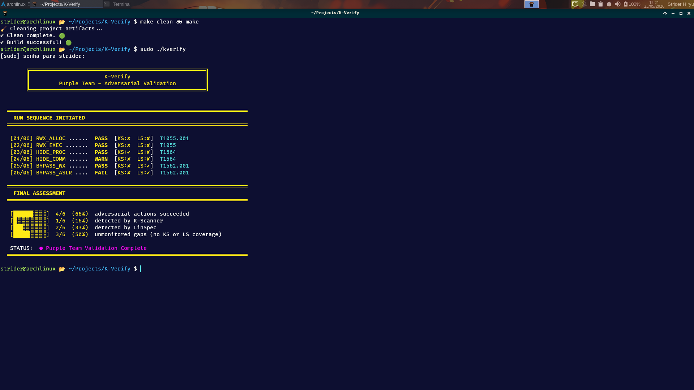
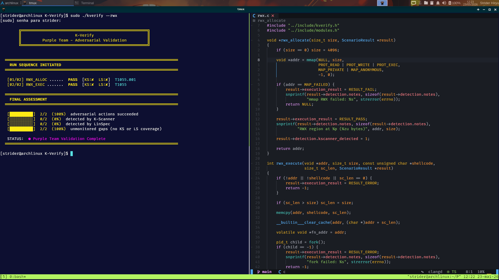
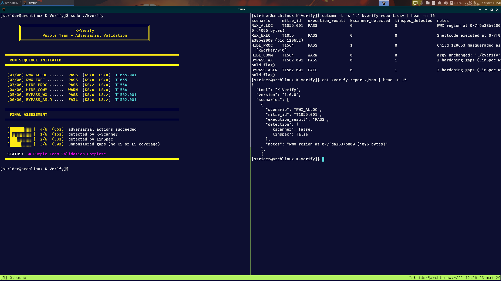

# 🐧 K-Verify

Purple Team adversarial validation suite for the SYNTROPY forensic ecosystem.

[](https://kernel.org)
[](https://gcc.gnu.org/)
[](LICENSE)
[](#-roadmap)
[](https://security.archlinux.org/)
[](#-overview)

---

## ● Overview

K-Verify is a Purple Team adversarial validation tool designed to stress-test the detection capabilities of the SYNTROPY forensic ecosystem — **K-Scanner** and **LinSpec**.

It executes controlled adversarial actions on a live Linux system and then cross-references each action against the kernel interfaces that the Blue Team tools use for detection. Each scenario is mapped to a **MITRE ATT&CK** technique, and the final assessment includes a **Detection Gap Analysis** that highlights blind spots where no tool provides coverage.

**Core Validation Areas:**

* **RWX Memory Detection:** Allocates writable+executable memory and verifies K-Scanner detection
* **Process Masquerading:** Forks and renames processes to test /proc enumeration accuracy
* **Mitigation Bypass:** Attempts W^X and ASLR bypass and validates LinSpec auditing
* **Detection Gap Analysis:** Counts scenarios with zero detection coverage (neither K-Scanner nor LinSpec)
* **MITRE ATT&CK Correlation:** Each adversarial technique mapped to its MITRE technique ID

---

## ● Features

* Six adversarial scenarios mapped to MITRE ATT&CK technique IDs
* Automated verification against K-Scanner and LinSpec detection logic
* Purple Team validation matrix with color-coded terminal output
* **Detection Gap Analysis** — identifies blind spots with no tool coverage
* **MITRE ATT&CK mapping** — technique IDs in terminal, JSON, and CSV output
* **Silent JSON mode** (`--json`) — suppress banner output for CI/CD pipelines
* Structured export (JSON/CSV) for integration into reporting pipelines
* Modular C99 engine — each scenario is an independent module
* Read-only verification phase that assesses system state without executing attacks
* Child process lifecycle management with cleanup mode

---

## ● MITRE ATT&CK Mapping

Each scenario is correlated with a real-world MITRE ATT&CK technique:

| Scenario | Technique ID | Description |
|---|---|---|
| RWX_ALLOC | [T1055.001](https://attack.mitre.org/techniques/T1055/001/) | Process Injection: Portable Executable Injection |
| RWX_EXEC | [T1055](https://attack.mitre.org/techniques/T1055/) | Process Injection |
| HIDE_PROC | [T1564](https://attack.mitre.org/techniques/T1564/) | Hide Artifacts |
| HIDE_COMM | [T1564](https://attack.mitre.org/techniques/T1564/) | Hide Artifacts |
| BYPASS_WX | [T1562.001](https://attack.mitre.org/techniques/T1562/001/) | Impair Defenses: Disable or Modify Tools |
| BYPASS_ASLR | [T1562.001](https://attack.mitre.org/techniques/T1562/001/) | Impair Defenses: Disable or Modify Tools |

Technique IDs are displayed in the terminal output, embedded in JSON export, and included in CSV reports.

---

## ● Example Output

```
        ╔═══════════════════════════════════╗
        ║            K-Verify               ║
        ║     Purple Team — Adversarial     ║
        ║          Validation               ║
        ╚═══════════════════════════════════╝

  ══════════════════════════════════════════════════════════════════════════
    RUN SEQUENCE INITIATED
  ══════════════════════════════════════════════════════════════════════════

  [01/06] RWX_ALLOC ......  PASS  [KS:✔  LS:✘]  T1055.001
  [02/06] RWX_EXEC .......  PASS  [KS:✔  LS:✘]  T1055
  [03/06] HIDE_PROC ......  PASS  [KS:✔  LS:✘]  T1564
  [04/06] HIDE_COMM ......  WARN  [KS:✘  LS:✘]  T1564
  [05/06] BYPASS_WX ......  PASS  [KS:✘  LS:✔]  T1562.001
  [06/06] BYPASS_ASLR ....  FAIL  [KS:✘  LS:✔]  T1562.001

  ══════════════════════════════════════════════════════════════════════════
    FINAL ASSESSMENT
  ══════════════════════════════════════════════════════════════════════════

  [██████░░░░]  4/6  (66%)  adversarial actions succeeded
  [█░░░░░░░░░]  1/6  (16%)  detected by K-Scanner
  [██░░░░░░░░]  2/6  (33%)  detected by LinSpec
  [█████░░░░░]  3/6  (50%)  unmonitored gaps (no KS or LS coverage)

   STATUS:  Purple Team Validation Complete
  ══════════════════════════════════════════════════════════════════════════
```

---

## ● How It Works

K-Verify operates in three phases:

### Phase 1: Adversarial Execution

Each scenario executes a controlled offensive technique:

* **RWX_ALLOC:** `mmap` with `PROT_READ|PROT_WRITE|PROT_EXEC`
* **RWX_EXEC:** Shellcode (exit(0)) written and executed in RWX region
* **HIDE_PROC:** Fork + `prctl(PR_SET_NAME, "[kworker/0:0]")`
* **HIDE_COMM:** Direct write to `/proc/self/cmdline`
* **BYPASS_WX:** Attempt RWX mmap, test enforcement
* **BYPASS_ASLR:** Read `randomize_va_space`

### Phase 2: Detection

For each scenario, K-Verify queries the kernel interfaces that the target Blue Tool uses:

* **K-Scanner path:** Parses `/proc/[PID]/maps` for `rwx` permission entries
* **LinSpec path:** Reads `/proc/sys/kernel/*` hardening parameters

**Note:** K-Scanner and LinSpec are reference tools from the [SYNTROPY](https://github.com/jeffersoncesarantunes) forensic ecosystem. They are **not required** to run K-Verify. The detection logic for both tools is embedded directly in K-Verify's own source code — it reads the same kernel interfaces they would use and *predicts* whether detection would occur. This makes K-Verify a fully self-contained binary with no external dependencies beyond the Linux kernel itself. The results shown in the "KS" and "LS" columns are a **synthetic detection assessment**, not a live integration with external tools.

### Phase 3: Correlation

Results are presented as a **validation matrix** showing:

* Whether the adversarial action succeeded
* Whether each Blue Tool would detect it
* The MITRE ATT&CK technique ID
* A summary with progress bars for adversarial success, detection coverage, and **unmonitored gaps**

### Detection Gap Analysis

The final assessment includes a dedicated metric: **unmonitored gaps** — scenarios where neither K-Scanner nor LinSpec provides detection coverage. These represent the highest-risk blind spots in your detection posture.

```
[█████░░░░░]  3/6  (50%)  unmonitored gaps (no KS or LS coverage)
```

---

## ● Build and Run

```bash
# Clone the repository
git clone https://github.com/jeffersoncesarantunes/K-Verify.git
cd K-Verify

# Build the project
make clean && make

# Run all scenarios with default terminal output
sudo ./kverify

# Run all scenarios with silent JSON export (no banner, CI/CD ready)
sudo ./kverify --json

# Export results to CSV
sudo ./kverify --csv

# Run a specific module
sudo ./kverify --rwx
sudo ./kverify --hide
sudo ./kverify --bypass

# Read-only verification (no adversarial actions)
sudo ./kverify --verify-only

# Clean up any remaining child processes
sudo ./kverify --cleanup
```

**JSON silent mode:** When `--json` is used alone, the tool skips the banner and terminal output entirely, writing only the JSON report file. This is designed for automated pipelines, cron jobs, and CI/CD integration.

---

## ● Post-Analysis & Report Viewing

After generating the reports, you can quickly inspect them directly from the terminal using standard Linux utilities:

```bash
# View aligned and formatted CSV results (top 15 results)
column -t -s ',' kverify-report.csv | head -n 16

# Quickly inspect the structured JSON output header
cat kverify-report.json | head -n 15
```

---

## ● Project in Action


*1 - Complete dashboard output showing all validation scenarios, tool coverage, and final metrics.*


*2 - Running a specific module (`--rwx`) alongside code-level analysis of `rwx.c`.*


*3 - Post-analysis workspace in `tmux` formatting the generated CSV and JSON reports.*

---

## ● Operational Integrity

K-Verify is designed for controlled adversarial testing:

* All shellcode is benign — `exit(0)` only
* Child processes are tracked and reaped
* `--cleanup` mode kills remaining children
* `--verify-only` performs read-only assessment
* No persistent system modifications
* No network activity or lateral movement
* Transparent logging of every action

---

## ● Deployment

### Requirements

* Linux Kernel 5.x or newer
* gcc
* make
* Root privileges (for /proc access and mmap tests)
* UTF-8 compatible terminal

---

## ● Repository Structure

```text
├── build/
│   └── obj/
├── docs/
│   ├── ADVERSARIAL_SCENARIOS.md
│   ├── PURPLE_MODEL.md
│   └── VALIDATION_PROTOCOL.md
├── Imagens/
│   ├── kverify1.png
│   ├── kverify2.png
│   └── kverify3.png
├── include/
│   ├── colors.h
│   ├── kverify.h
│   └── modules.h
├── reports/
├── scenarios/
├── src/
│   ├── bypass.c
│   ├── hide.c
│   ├── main.c
│   ├── rwx.c
│   ├── utils.c
│   └── verify.c
├── tests/
├── LICENSE
├── Makefile
└── README.md
```

---

## ● Tech Stack

* **Language:** C99
* **Data Sources:** `/proc`, `mmap`, `prctl`
* **Build Tool:** GNU Make
* **Target Platforms:** Linux Kernel 5.x / 6.x

---

## ● Roadmap

* [x] Modular C99 engine with RWX, hide, and bypass modules
* [x] Verification engine cross-referencing K-Scanner and LinSpec
* [x] Color-coded terminal validation matrix
* [x] JSON/CSV structured export with MITRE ATT&CK IDs
* [x] Detection Gap Analysis (unmonitored blind spots)
* [x] Silent JSON mode for CI/CD pipelines
* [x] `--verify-only` read-only assessment mode
* [ ] eBPF-based detection validation (K-Scanner integration)
* [ ] YARA rule-based detection pattern matching
* [ ] Multi-process coordinated attack scenarios

---

## ● Documentation

[](./docs/PURPLE_MODEL.md)
[](./docs/ADVERSARIAL_SCENARIOS.md)
[](./docs/VALIDATION_PROTOCOL.md)

---

## ● Etymology & Origin

The name **K-Verify** is derived from the **K**ernel interface that underpins all validation logic. Unlike a traditional scanner that enumerates state, K-Verify *verifies* — it actively tests whether the detection mechanisms in the SYNTROPY ecosystem correctly identify adversarial behavior. The "K" also reflects its integration with the **K**-Scanner detection engine.

---

## ● License

[](./LICENSE)

*This project is licensed under the MIT License.*
